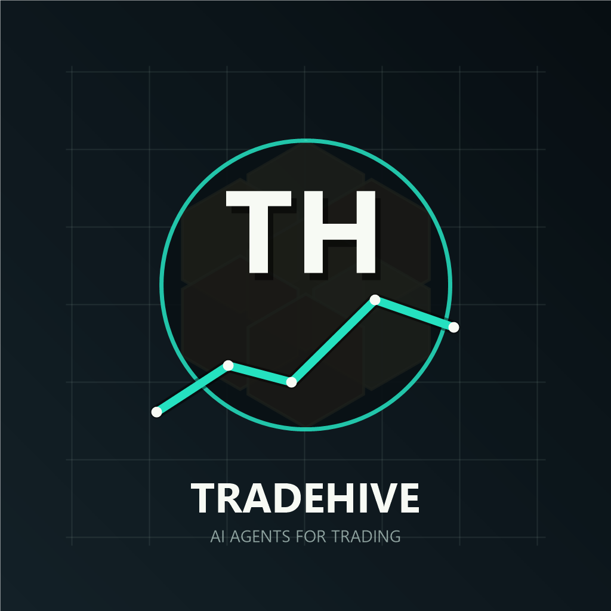

# TradeHive AI Agents

<p align="center">
  
</p>

TradeHive is an experimental open-source framework for building, testing, and orchestrating AI agents for market research, backtesting, trading analysis, risk monitoring, and workflow automation.

The project is designed as a practical playground for agentic systems in financial markets. It combines LLM-powered reasoning, market-data pipelines, strategy research tools, risk controls, and independently runnable Python agents.

> This is an educational research project. It is not financial advice, not a trading signal service, and not a guarantee of profit.

---

## What TradeHive Does

TradeHive brings together specialized agents that can:

- Research trading ideas from text, PDFs, videos, and web sources
- Generate and test backtesting strategies
- Monitor market structure, volume, funding, liquidations, and whale activity
- Analyze Solana and crypto-market data
- Compare outputs across multiple LLM providers
- Support risk-first decision workflows
- Produce reports, alerts, and structured research outputs
- Run agents independently or through a shared orchestration loop

The goal is not to create a magic trading bot. The goal is to make agentic trading research easier to inspect, extend, and improve.

---

## Core Philosophy

1. **Research before execution**  
   Every trading idea should be tested, documented, and reviewed before real capital is involved.

2. **Risk before reward**  
   Risk controls, position sizing, loss limits, and circuit breakers matter more than prediction.

3. **Agents should be inspectable**  
   Agent outputs should be saved, logged, and easy to review.

4. **No fake market data**  
   The system should use real APIs, real historical data, or fail clearly.

5. **LLMs are reasoning tools, not oracles**  
   Models can help summarize, compare, and generate hypotheses, but final responsibility stays with the user.

---

## Agent Categories

### Research and Backtesting

- `rbi_agent.py` - turns trading ideas into backtesting workflows
- `research_agent.py` - gathers strategy ideas and research inputs
- `websearch_agent.py` - searches for strategy material and extracts useful concepts
- `strategy_agent.py` - manages strategy definitions and signals

### Market Analysis

- `whale_agent.py` - monitors large-wallet activity
- `funding_agent.py` - tracks funding-rate opportunities
- `liquidation_agent.py` - analyzes liquidation events
- `sentiment_agent.py` - evaluates social and market sentiment
- `chartanalysis_agent.py` - uses AI to reason about chart setups
- `volume_agent.py` - scans volume behavior across markets

### Trading and Risk

- `trading_agent.py` - AI-assisted trading decision workflow
- `risk_agent.py` - portfolio risk and circuit-breaker logic
- `copy_agent.py` - copy-trading research support
- `swarm_agent.py` - multi-model consensus and comparison layer

### Solana and Crypto Infrastructure

- `sniper_agent.py` - watches new token launches
- `tx_agent.py` - monitors wallet transactions
- `solana_agent.py` - combines Solana-specific signals
- `new_or_top_agent.py` - scans new and top tokens

### Workflow and Content Agents

- `chat_agent.py`
- `tweet_agent.py`
- `video_agent.py`
- `clips_agent.py`
- `phone_agent.py`
- `prompt_agent.py`
- `focus_agent.py`

---

## Architecture

```text
src/
+-- agents/          # Independent AI agents
+-- models/          # LLM provider abstraction
+-- strategies/      # Trading strategy definitions
+-- scripts/         # Utility scripts
+-- data/            # Outputs, logs, reports, and datasets
+-- config.py        # Global configuration
+-- main.py          # Main orchestration loop
+-- nice_funcs.py    # Shared trading utilities
+-- nice_funcs_hl.py # Hyperliquid utilities
```

Most agents are standalone scripts. You can run one agent directly, or use the main orchestrator to coordinate multiple agents.

---

## LLM Provider Support

TradeHive uses a model factory pattern so agents can work with different providers through a common interface.

Supported providers include:

- OpenAI
- Anthropic
- DeepSeek
- Groq
- xAI
- OpenRouter
- Ollama/local models

Example:

```python
from src.models.model_factory import ModelFactory

model = ModelFactory.create_model("openai")
response = model.generate_response(
    system_prompt="You are a trading research assistant.",
    user_content="Analyze this market setup.",
    temperature=0.2,
    max_tokens=1000,
)
```

---

## Quick Start

### 1. Clone the repository

```bash
git clone https://github.com/Satya8208/tradehive-ai-agents-for-trading.git
cd tradehive-ai-agents-for-trading
```

### 2. Set up the environment

Use the existing project environment if available:

```bash
conda activate tflow
pip install -r requirements.txt
```

### 3. Configure environment variables

Copy the example file:

```bash
cp .env_example .env
```

Add only the API keys you actually need.

Common variables include:

```bash
OPENAI_KEY=
ANTHROPIC_KEY=
DEEPSEEK_KEY=
GROQ_API_KEY=
OPENROUTER_API_KEY=

BIRDEYE_API_KEY=
TRADEHIVE_API_KEY=
COINGECKO_API_KEY=

SOLANA_PRIVATE_KEY=
HYPER_LIQUID_ETH_PRIVATE_KEY=
RPC_ENDPOINT=
```

Never commit `.env` or private keys.

### 4. Run an agent

```bash
python src/agents/risk_agent.py
```

Or run the main orchestrator:

```bash
python src/main.py
```

---

## Backtesting

TradeHive includes research and backtesting workflows designed around real market data.

Sample OHLCV data is available at:

```text
src/data/rbi/BTC-USD-15m.csv
```

Backtesting work should use real historical data and established libraries such as:

- `backtesting.py`
- `pandas_ta`
- `talib`

---

## Creating a New Agent

New agents should follow the existing pattern:

1. Create a file in `src/agents/`
2. Use the `[purpose]_agent.py` naming style
3. Make the agent independently executable
4. Use `ModelFactory` for LLM access
5. Store outputs in `src/data/[agent_name]/`
6. Add config values to `src/config.py` only when needed

Example structure:

```python
from src.models.model_factory import ModelFactory

class ExampleAgent:
    def __init__(self):
        self.model = ModelFactory.create_model("openai")

    def run(self):
        pass

if __name__ == "__main__":
    agent = ExampleAgent()
    agent.run()
```

---

## Safety Notes

This repository includes code related to trading automation. Use it carefully.

Before using any live-trading functionality:

- Read the code
- Backtest your strategy
- Use paper trading first
- Start with tiny size
- Set strict loss limits
- Never expose private keys
- Never assume an AI model is correct
- Never run code you do not understand with real funds

TradeHive is not responsible for trading losses, exchange issues, API failures, model errors, or misconfigured execution.

---

## Project Status

TradeHive is experimental and under active development.

Some agents are mature enough for research workflows. Others are prototypes, utilities, or exploratory examples. Expect rough edges, incomplete integrations, and fast-moving changes.

The best way to use this repository is as a foundation for learning, testing, and building your own agentic systems.

---

## Contributing

Contributions are welcome, especially around:

- Better documentation
- Safer defaults
- More tests
- Cleaner agent interfaces
- Backtesting improvements
- Risk-management tooling
- New data adapters
- Better examples
- Security hardening

Please avoid submitting code that depends on fake data, hidden services, or private credentials.

---

## Disclaimer

TradeHive is an experimental educational project. It is not investment advice, financial advice, or a recommendation to buy or sell any asset.

Trading cryptocurrency and other financial instruments involves substantial risk. You are responsible for your own decisions, your own keys, your own exchange accounts, and your own losses.

Use this project to learn, research, and build carefully.
